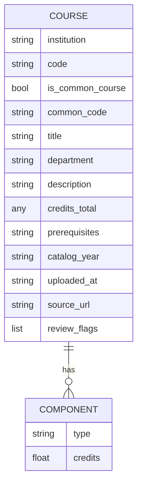

# Course record and decision data model

## Course record

A record is a plain JSON dict built by `parsers.base.make_record` (no schema class; the contract is documented in the `parsers/base.py` docstring and enforced only by [`validate_dataset.py`](../operations/validation-and-deploy.md)).

Caption: parser-owned course fields and the optional component list (components carry only `type` for most parsers).

**Parser-owned fields** (from `make_record`):
- `code` is `normalize_code`d (uppercased, spaces removed; `&` kept), e.g. `MATH&151`, `BUS101`.
- `is_common_course` / `common_code` come from `COMMON_COURSE_RE` (`PREFIX&NNN`): a WA Common Course Number (CCN), a statewide join key across colleges.
- `credits_total` is a float, a `{min, max}` dict (variable credit) or `None`. Semantics: [credit values](../domain/credit-values.md).
- `components` is a list of `{type, credits?}` (Lecture, Lab, Clinical, ...); used mainly for lab-science detection in the [classifier](../domain/classification.md).
- Text fields pass through `normalize_text` (HTML entities decoded, smart quotes folded).
- Optional `review_flags` set at ingest (e.g. `CREDITS_DERIVED_FLAG` for Pierce, retained-unpublished flags from `retain_unpublished.py`); `classify()` carries these through.
- `dedupe(records)` keeps the longest description per `(institution, code)`.

**Classifier-owned fields** (`classify_courses.CLASSIFIED_FIELDS`): `credit_type` (deprecated alias of the primary), `credit_types` (primary first, then secondaries), `primary_credit_type`, `hs_credits` (`credits_total / 5`, same shape as `credits_total`), `level`, `is_sub_100`, `classification_rule` (e.g. `specific:<inst>:<code>`, `common-course:<ccn>`, `prefix:<inst>:<pfx>`, `prefix:<pfx>`, `fallback`), `confidence`, `review_flags`.

Invariants checked in `validate_dataset.py`: required fields present, no duplicate `(institution, code)`, every credit type in `VALID_TYPES`, `Elective` never alongside another type, `review_flags` free of duplicates, one `catalog_year` per college.

## Decisions (human overrides)

Decisions are not stored in the repo. They live in a Google Sheet behind an Apps Script web app (`APPS_SCRIPT_URL` in `build_html.py`); the setup runbook is `decisions_setup/SETUP.md` (outside this wiki's scope). The v2 schema is append-only:

`decision_id | course_code | institution | applies_to | status | override_credit_types | override_hs_credits | rationale | decided_by | decided_date | source_citation | decided_for_year | is_current | superseded_by | created_at | last_updated`

- `applies_to` and `override_credit_types` are pipe-delimited strings (`all`, `tcc`, `tcc|olympic`).
- Every save appends a row; the prior current row gets `is_current=FALSE` and `superseded_by`.
- CCNs default to `applies_to=all`.

How the browser overlays decisions on base records (`effective()`), and which fields are redacted for the public view, is in [viewer and decisions](viewer-and-decisions.md). Bulk AI-assisted decisions come from the [OSPI audit workflow](../workflows/ospi-audit.md).
