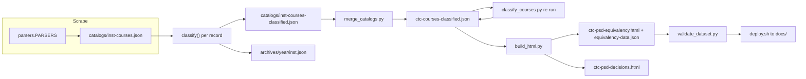

# Pipeline overview

The repo is a flat set of Python scripts (no package manifest or test suite; deps are managed with `uv` in a local `.venv`, per `CLAUDE.md`). It scrapes six Washington community and technical college catalogs (~6,900 courses), classifies each course to a PSD high-school credit type under the WA SBE 24-credit framework, and emits two single-file HTML tools. Product context lives in `README.md`; this page is the canonical description of how the stages connect.

## Stages and artifacts

Caption: `build_dataset.py` drives scrape, classify, archive, merge and re-classify; `build_html.py` and `deploy.sh` take over from the merged file.

| Stage | Owner | Output |
|---|---|---|
| Scrape one college | `build_dataset.run_one` -> parser from [catalog parsers](../integrations/catalog-parsers.md) | `catalogs/<inst>-courses.json` (raw) |
| Classify | `classify_courses.classify` ([classification](../domain/classification.md)) | `catalogs/<inst>-courses-classified.json`, plus snapshot `archives/<catalog_year>/<inst>.json` |
| Merge | `merge_catalogs.main` globs `catalogs/*-courses-classified.json` | `ctc-courses-classified.json` |
| Re-classify merged | `classify_courses.py` run as a subprocess by `build_dataset.main` | same file, rewritten in place |
| Build outputs | `build_html.py` ([viewer](viewer-and-decisions.md)) | `ctc-psd-equivalency.html`, `equivalency-data.json` sidecar, `ctc-psd-decisions.html` |
| Gate + stage | `validate_dataset.py`, `deploy.sh` ([validation and deploy](../operations/validation-and-deploy.md)) | `docs/index.html`, `docs/equivalency-data.json` |

`catalogs/`, `archives/`, the generated JSON and HTML are generated data, not hand-edited source; many are excluded from OpenWiki by `.openwikiignore`.

## Invariants worth knowing before editing

- **Institution config is duplicated in two places.** `INSTITUTIONS` in `build_dataset.py` (parser name + scrape config, `enabled` flag) and `INSTITUTIONS` in `build_html.py` (id + display label, order of filter checkboxes). Adding a college touches both, plus `parsers/__init__.PARSERS` when the platform is new, and `EXPECTED_INSTITUTIONS` in `validate_dataset.py` (floor counts).
- **Merge always runs, even after a failure.** `build_dataset.main` merges and re-classifies even if one college failed, so the other colleges stay current; it then exits non-zero and lists failed colleges. Existing files for a failed college are left untouched.
- **Re-classification after merge is mandatory.** Each per-college classified file is frozen at its last scrape, so rules added later would otherwise silently not apply to colleges not re-scraped. `validate_dataset.validate_classification_current` enforces this.
- **Collapse guard.** `run_one` raises when a scrape yields fewer than `COLLAPSE_THRESHOLD` (default 0.5, env `COLLAPSE_THRESHOLD`; `FORCE_SCRAPE=1` disables) of the records already on disk, so a blocked crawl cannot wipe a college. Details in [catalog refresh](../operations/catalog-refresh.md).
- **Archive key.** Snapshots are keyed by the first record's `catalog_year`; Bates uses `scraped <date>` because its catalog has no year ([parsers](../integrations/catalog-parsers.md)).
- `merge_catalogs.py`'s own docstring is stale about `build_dataset` overwriting the merged file with only one college's records; current `build_dataset.main` always merges all files on disk.

## Entry points

| Intent | Command |
|---|---|
| Refresh all enabled colleges | `python build_dataset.py` |
| Refresh a subset | `python build_dataset.py tcc olympic` |
| Re-classify after editing rules | `python classify_courses.py` |
| Re-merge only | `python merge_catalogs.py` |
| Rebuild HTML/sidecar | `python build_html.py` |
| Year-over-year diff | `python diff_catalogs.py --year-from 2025-2026 --year-to 2026-2027 -o diff.md` |

Scrapes are network-bound (Acalog colleges take days at the polite rate; see [catalog refresh](../operations/catalog-refresh.md)). For rule-only changes you do not need to scrape: edit `classify_courses.py`, run it, then `build_html.py` and `validate_dataset.py`.

## Related

- Record shape and classified fields: [data model](data-model.md).
- Credit semantics that every stage depends on: [credit values](../domain/credit-values.md).
