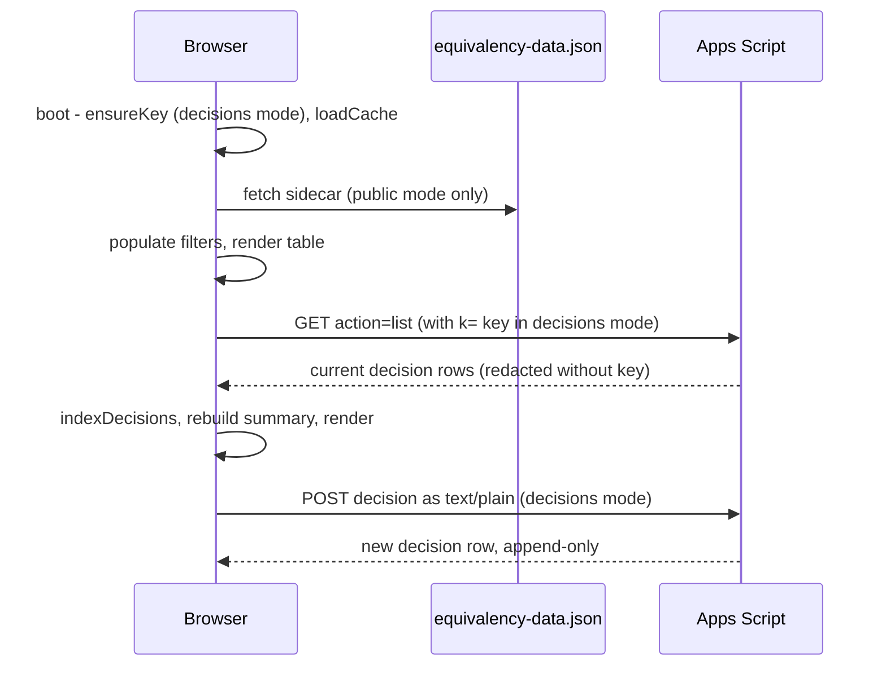

# HTML viewers and the decisions backend

`build_html.py` is a script (no functions beyond `emit`) holding one big HTML/CSS/JS string, `TEMPLATE`, filled by `emit(mode)` with `##PLACEHOLDER##` substitution. It reads `ctc-courses-classified.json` ([pipeline](pipeline-overview.md)) and writes three files on import:

| Output | Mode | Data | Audience |
|---|---|---|---|
| `ctc-psd-equivalency.html` | `public` | `DATA = null`; fetched at boot from `./equivalency-data.json` (`DATA_SIDECAR_URL`) | counselors, college staff, families; deployed to GitHub Pages |
| `equivalency-data.json` | sidecar | compact JSON of all records | consumed by the public file and by `validate_dataset.py` |
| `ctc-psd-decisions.html` | `decisions` | data inlined (about 1 MB) so it opens from `file://` | district deciders; local only |

Template facts are injected from Python constants: `INSTITUTIONS` (id/label list in filter order), `DECIDER_ROLES` (the `decided_by` dropdown, including "AI Classifier"), the credit-type list `ctypes`, department options, build date, and `APPS_SCRIPT_URL`.

## Runtime flow in the browser

Caption: `boot()` loads base data first, then overlays decisions; saves append rows rather than editing.

## Decision overlay (`effective(c)`)

For each course the viewer finds a decision by `course_code|institution` (`DECISIONS_BY_KEY`), else an `applies_to` containing `all` that matches `c.common_code || c.code` (`DECISIONS_BY_CODE_ALL`). A decision's `override_credit_types` replaces the base `credit_types`; `override_hs_credits` replaces `hs_credits`; `dropRedundantElective` removes Elective when another type is present (same rule as the validator and the server-side audit scripts). Backend failure falls back to a `localStorage` cache (`LS_KEY`); with no configured backend, saves persist locally only. "Clear" appends a `pending` row with blank overrides to keep the audit trail. The row schema is in [data model](data-model.md); a decider selecting `applies_to` boxes controls scope.

Decisions are therefore a **runtime layer** over the [classifier](../domain/classification.md): changing a decision never changes the JSON outputs, and the validator's `validate_ccn_consistency` only sees the base layer.

## Public/private boundary

- Per `CLAUDE.md` and the `build_html.py` comments: `list`/`history` are publicly reachable but redacted (no rationale, `decided_by`, `source_citation`) without `?k=<key>`; POST requires the key stored as the script's `API_KEY` property. The key is prompted for once in decisions mode and kept in `localStorage` (`KEY_LS`); a rejected key is dropped (`dropKey`).
- Decision markers, rationale, and sub-100/flag badges are decider-only (`MODE === "decisions"`); the public view shows effective values without revealing how a decision was made. District stance: decision rationale is not published.
- The public view still shows the `derived` badge for Pierce credits (`creditsAreDerived`; [credit values](../domain/credit-values.md)).
- `deploy.sh` copies only the public HTML (as `docs/index.html`) and the sidecar. The decider tool was removed from `docs/` on 2026-06-12 because the repo is public. Do not reintroduce it, embed keys, or commit per-course decision reasoning ([validation and deploy](../operations/validation-and-deploy.md)).
- `exportCSV` exports the filtered view with effective types, including decision rationale columns (blank in public mode).

## Local viewing

`./serve.sh [port]` runs `python3 -m http.server` at the repo root; open `/ctc-psd-equivalency.html` or `/ctc-psd-decisions.html`. A file:// open of the public viewer shows a banner explaining the fetch is blocked.

## Change recipes

- **New filter/column/badge:** edit `TEMPLATE` (`applyFilters`, `render`, `detailRow`, `flagBadges`, `buildSummary`); keep decider-only features behind `MODE === "decisions"`. Rebuild and open via `./serve.sh`; no automated UI tests exist.
- **New college or credit type:** `INSTITUTIONS` / `ctypes` here plus `PILL_CLASS`; see [catalog parsers](../integrations/catalog-parsers.md) and [classification](../domain/classification.md).
- **New decider role:** `DECIDER_ROLES`.
- **Backend URL change:** `APPS_SCRIPT_URL` (setup runbook `decisions_setup/SETUP.md` is outside this wiki).
- Output files are generated; edit `build_html.py`, never the HTML. Validate with `python build_html.py && python validate_dataset.py` (the validator reads `equivalency-data.json` by default).
