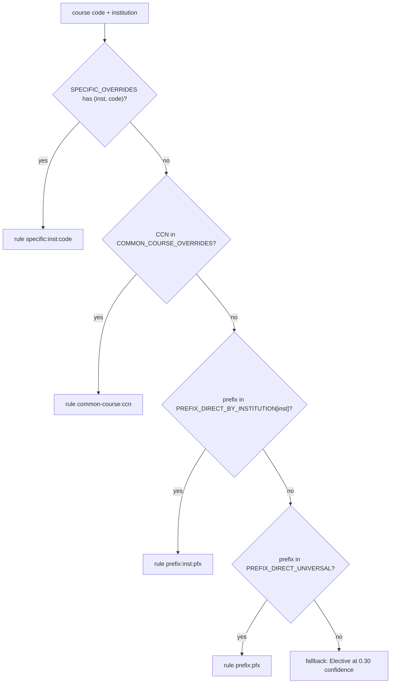

# Credit-type classification

Start here when a course lands on the wrong PSD credit type, when a decider hands back overrides, or when a new prefix appears. Everything is in `classify_courses.py` (rules as module-level dicts, logic in `classify`). It runs per record during [ingest](../architecture/pipeline-overview.md) and again over the whole merged dataset.

## Taxonomy

`TYPES` (mirrored by `VALID_TYPES` in `validate_dataset.py` and `ctypes` in `build_html.py`): ELA, Math, Science (Lab), Science (Non-Lab), four Social Studies subtypes (US History, World History, Washington State History, Civics) plus Social Studies - Elective, Fine & Performing Arts, World Language, Health, PE / Fitness, CTE, Elective. Adding a type means updating all three lists (and `PILL_CLASS` in the viewer).

## Resolution order (`_resolve_primary`)

Caption: first matching tier wins; the label is stored in `classification_rule`.

Each table value is `(credit_type, confidence, review_flags)`. Prefix is the leading letters of the code (`re.match("([A-Z]+)")`).

- **Common Course Number overrides** (`COMMON_COURSE_OVERRIDES`) apply at every college offering that CCN; this is where statewide decisions go (e.g. `HIST&146` US History, `CMST&220` ELA, `ENGR&204` Science (Lab)). Several entries exist solely so Bates or TCC records, which joined later, agree with the other colleges.
- **Per-institution prefix tables** hold workforce-track prefixes (mostly CTE at 0.85 with `_PFX_FLAG`) from the 2026-06 manual review. Add entries only when a concrete conflict emerges.
- **Specific overrides** are for local-prefix courses unique to one college (TCC HIST, Bates HS-completion social studies, Clover Park `MAT99`/`MAT103`, CCFE courses counted as CTE).

## Post-processing inside `classify`

- **Level:** number parsed from the code; `< 100` sets `is_sub_100` and flag "Sub-100 - Fresh Start (Open Doors) review".
- **HS credits:** `credits_total / 5`, rounded to 2 places, applied to both scalar and `{min,max}`. Semantics and the Pierce exception: [credit values](credit-values.md).
- **Science lab refinement** (only when the primary starts with "Science"), evidence strongest first: (1) declared `Contact Hours` table in the description, authoritative both ways; (2) if a specific/common-course override decided it, keep that decision (components may be keyword-inferred phantoms); (3) stored `components`; (4) `w/ Lab` / `with Lab` in the title; result is forced to Lab or Non-Lab.
- **Secondaries:** `SECONDARY_TYPES_COMMON`, `SECONDARY_TYPES_BY_INSTITUTION`, `SECONDARY_TYPES_BY_PREFIX`, deduped, primary removed. Primary is always `credit_types[0]`.
- **Flags:** ingest-stage `review_flags` are inherited, rule flags appended, then deduped with `dict.fromkeys`.

## Why idempotency is a hard requirement

`classify_courses.py` reads and rewrites `ctc-courses-classified.json` in place, and `validate_dataset.validate_classification_current` re-runs `classify()` on the published data and fails if any `CLASSIFIED_FIELDS` differ. So any new rule must give identical output when applied twice, and the dataset must be re-classified (`python classify_courses.py`) after every rule edit, otherwise validation reports the classification as stale.

## Interplay with human decisions

Rules here produce the **base layer**. District decisions in the Sheet override it only at view time ([viewer and decisions](../architecture/viewer-and-decisions.md)); they never change this file's output. Overrides handed back from manual review (and AI audit outcomes from the [OSPI audit](../workflows/ospi-audit.md)) are folded into these tables when they should be permanent. `validate_ccn_consistency` warns when one CCN resolves differently across colleges at the base layer.

## Change recipe: add or change a rule

1. Choose the narrowest tier (specific code, then CCN, then institution prefix, then universal prefix).
2. Edit the table in `classify_courses.py`; use a confidence of 0.85-0.95 for decided rules and add a dated explanatory flag.
3. `python classify_courses.py` (prints the credit-type distribution and low-confidence counts).
4. `python build_html.py && python validate_dataset.py`.
5. Optional: `python diff_catalogs.py <old> <new>` between snapshots to see "Credit-type changed" and "Confidence dropped" rows.

Non-goals: do not hand-edit `ctc-courses-classified.json` or per-college classified files; they are regenerated. There is no unit-test file for the classifier; the validator is the regression net.
