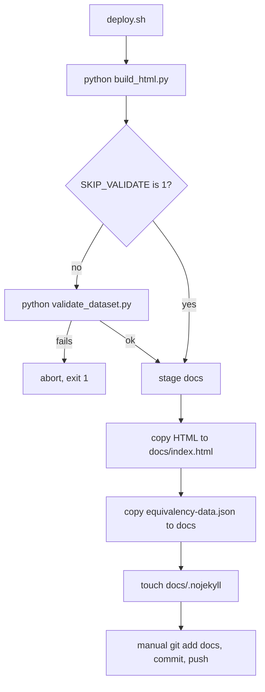

# Dataset validation, deploy and CI

The repo has **no unit-test suite**. `validate_dataset.py` is the quality gate: it asserts properties of the published dataset (`equivalency-data.json` by default, or a path argument). Its docstring records the history: every serious defect (Bates dropping all Common Course Numbers for four months, Green River's blank credits, a WAF challenge read as an empty catalog, Pierce labelled with the wrong year) was a *silent absence* that produced a plausible smaller file. Checks encode what "plausible" is NOT.

Exit code 0 means no errors (warnings allowed); `--strict` also fails on warnings.

## Checks (`CHECKS`, in order)

| Check | Fails (ERROR) when | Notes |
|---|---|---|
| `validate_shape` | records lack `institution`, `code`, `title`, `credit_types`, `catalog_year`; blank titles; duplicate `(institution, code)` | viewer reads these |
| `validate_coverage` | a college is absent or under its floor in `EXPECTED_INSTITUTIONS` (bates 900, cloverpark 800, greenriver 1000, olympic 900, pierce 700, tcc 600) | warns on unexpected colleges; floors catch collapse, not churn |
| `validate_credits` | a college has more than `MAX_MISSING_CREDITS` (25%) records without `hs_credits` | `CREDITS_EXEMPT` is empty since Pierce credits are derived |
| `validate_common_courses` | a college has zero `&` Common Course Number records | warns when under 10% of the median; the check that would have caught the Bates bug |
| `validate_flags` | duplicate entries in `review_flags` | proves `classify()` idempotence |
| `validate_derived_credits` | flagged-derived record has no `hs_credits` | warns with counts; see [credit values](../domain/credit-values.md) |
| `validate_types` | unknown type (not in `VALID_TYPES`), Elective alongside other types, or no type | |
| `validate_ccn_consistency` | never errors; warns when a CCN resolves differently across colleges | base layer only; decisions overlay at runtime |
| `validate_classification_current` | stored classification differs from re-running `classify()` on `CLASSIFIED_FIELDS` | catches stale per-college files after a rule change; fix by `python classify_courses.py` |
| `validate_catalog_year` | mixed catalog years inside one college | warns when colleges differ in edition (currently expected) |

When you change `classify_courses.py`, the stale-classification check is the one most likely to fire; when you add a college, update `EXPECTED_INSTITUTIONS` ([catalog refresh](catalog-refresh.md)). Keep `VALID_TYPES` aligned with `classify_courses.TYPES` and `build_html.ctypes` ([classification](../domain/classification.md)).

## Deploy (`deploy.sh`)

GitHub Pages serves the `main` branch `/docs` folder; live site https://psd401.github.io/ctc-psd-equivalency/.

Caption: the script rebuilds, gates on validation, stages only public files; commit and push are manual.

- Python comes from `$PYTHON`, else `./.venv/bin/python`, else `python3`. Activate the uv venv for any manual Python (`CLAUDE.md`).
- `SKIP_VALIDATE=1` bypasses the gate; use only with a verified reason.
- The repo is **public**: never commit keys, per-course decision reasoning, or audit artifacts, and never stage the decider tool ([viewer](../architecture/viewer-and-decisions.md)). `.gitleaksignore` exists for the security scan.
- `docs/` contents (`index.html`, `equivalency-data.json`) are generated; edit sources and re-run `deploy.sh`.
- Local viewing: `./serve.sh`.

## GitHub Actions (`.github/workflows/`)

- `security-scan.yml`: PRs, pushes to `main`, weekly Monday cron; delegates to the org reusable workflow `PSD401/.github/.../reusable-security-scan.yml@main`.
- `openwiki-update.yml`: on push to `main`, weekly cron, manual dispatch; delegates to the org reusable OpenWiki workflow (concurrency group cancels superseded runs). It regenerates this wiki; do not hand-edit generated pages (see `AGENTS.md`).
- `claude-review.yml`: runs on pull request open, synchronize, ready-for-review and reopen; skips `dependabot[bot]` actors (their callers cannot grant `id-token: write`). It is a thin caller of the org reusable workflow `PSD401/.github/.github/workflows/reusable-claude-review.yml@main` and passes only the `BEDROCK_API_KEY` secret. The review logic lives in that external workflow, which is not in this repository.

None of these run `validate_dataset.py`; validation is a local pre-deploy step.

## Narrow validation recipe

After classifier or parser changes: `python classify_courses.py && python validate_dataset.py` (success prints a `Validating ...` header, then one `OK — 0 errors, N warning(s)` summary line; failures print every `WARN`/`ERROR` line before `FAILED`). After viewer-only changes: `python build_html.py` and open via `./serve.sh`. Full rescrapes and `deploy.sh` are conditional on needing fresh data or publishing.

Note: `equivalency-data.json` is generated by `build_html.py`; if it is absent in your checkout, build it before validating.
